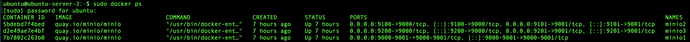

# Demonstrating Stable vs Unstable S3 Object Storage Behavior Behind an ADC

## 1. Introduction

S3-compatible object storage behaves differently from traditional web applications when deployed behind an Application Delivery Controller (ADC). While HTTP-based applications are often stateless and can tolerate load balancing across multiple backend servers, S3 object storage systems typically rely on **consistent request routing** and **stable backend affinity**.

This becomes especially important in the following situations:

- When object storage nodes do **not share state** (standalone nodes).
- When the system relies on **internal metadata ownership**.
- When requests belonging to the same workflow must reach the **same node**.
- When clients reuse HTTP/TCP connections for performance.

If an ADC distributes requests incorrectly or aggressively resets connections, several problems can appear:

- Inconsistent bucket or object visibility
- Failed uploads or downloads
- Metadata mismatches
- Connection resets (TCP RST)
- Application-level errors

For this reason, correct ADC configuration and architecture are critical when deploying S3-compatible storage behind load balancers.

This document demonstrates:

1. How to deploy a simple S3 lab environment using **MinIO containers**
2. How to configure an **A10 ADC in an intentionally unstable configuration**
3. How to reproduce **inconsistent backend behavior**
4. How to observe **TCP resets**
5. How to implement a **correct and stable ADC configuration**

---

## 2. Lab Architecture

### Linux Client
An Ubuntu Server 22.04 is being used as a client system. Basically you can use any type of system which feels comfortable to you. Just be aware that all tools and scripts shown and used at the client are Linux based.


### ADC
The demo uses an vThunder A10 ADC with ACOS v6.0.8.

- The A10 ADC gets a VIP 10.108.201.201 configured to;

- Distribute traffic accross three MinIO nodes.

### Backend Host

One Linux server running three standalone MinIO instances.

Backend Server
10.109.201.200


| Instance | Container | Port |
|--------|--------|--------|
| MinIO 1 | minio1 | 9000 |
| MinIO 2 | minio2 | 9100 |
| MinIO 3 | minio3 | 9200 |

Each container is a **completely independent object store**.


Used to generate S3 operations using `mc` (MinIO CLI).

---

## 3. Installing MinIO Containers

## Directory Structure

On the backend host:

```bash
sudo mkdir -p /opt/minio-lab
cd /opt/minio-lab
```

Docker Compose Configuration

Create:
```bash
/opt/minio-lab/docker-compose.yml
```
```yaml
version: '3'

services:

  minio1:
    image: quay.io/minio/minio
    container_name: minio1
    command: server /data --console-address ":9001"
    environment:
      MINIO_ROOT_USER: minioadmin
      MINIO_ROOT_PASSWORD: MinioDemo123!
    volumes:
      - ./data1:/data
    ports:
      - "9000:9000"
      - "9001:9001"

  minio2:
    image: quay.io/minio/minio
    container_name: minio2
    command: server /data --console-address ":9001"
    environment:
      MINIO_ROOT_USER: minioadmin
      MINIO_ROOT_PASSWORD: MinioDemo123!
    volumes:
      - ./data2:/data
    ports:
      - "9100:9000"
      - "9101:9001"

  minio3:
    image: quay.io/minio/minio
    container_name: minio3
    command: server /data --console-address ":9001"
    environment:
      MINIO_ROOT_USER: minioadmin
      MINIO_ROOT_PASSWORD: MinioDemo123!
    volumes:
      - ./data3:/data
    ports:
      - "9200:9000"
      - "9201:9001"
```

Start Containers

```bash
sudo docker compose up -d
```

Verify:
```bash
sudo docker ps
```


## 4. Installing the MinIO Client

On the client host:
```bash
curl -O https://dl.min.io/client/mc/release/linux-amd64/mc
chmod +x mc
sudo mv mc /usr/local/bin/
```
## 5. Configure MinIO Client Access

Direct access to backend nodes:
```bash
mc alias set minio1 http://10.109.201.200:9000 minioadmin MinioDemo123!
mc alias set minio2 http://10.109.201.200:9100 minioadmin MinioDemo123!
mc alias set minio3 http://10.109.201.200:9200 minioadmin MinioDemo123!
```
VIP access via ADC:
```bash
mc alias set minio-vip http://10.108.200.201 minioadmin MinioDemo123!
```

## 6. Create Unique Buckets Per Node
   
```bash
mc mb minio1/node1-only
mc mb minio2/node2-only
mc mb minio3/node3-only
```

Add identifying files:
```bash
echo "this is node1" > node1.txt
echo "this is node2" > node2.txt
echo "this is node3" > node3.txt

mc cp node1.txt minio1/node1-only/
mc cp node2.txt minio2/node2-only/
mc cp node3.txt minio3/node3-only/
```
Each backend now contains unique data.