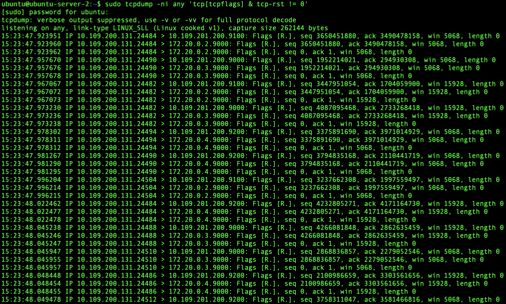

# Deploying S3 Object Storage with an unstable A10 ADC config

## 7. A10 ADC Configuration (Unstable Setup)

This configuration intentionally does not use persistence.
```bash
slb server minio-lab 10.109.201.200
  port 9000 tcp
  port 9100 tcp
  port 9200 tcp

slb service-group sg-minio-lab tcp
  method round-robin
  member minio-lab 9000
  member minio-lab 9100
  member minio-lab 9200

slb template tcp-proxy tp-break-minio
  idle-timeout 5

slb virtual-server vs-minio-lab 10.108.200.201
  port 80 http
    source-nat auto
    service-group sg-minio-lab
    template tcp-proxy tp-break-minio
```
## 8. Demonstrating Instability

Run repeated requests from the client.
```bash
for i in $(seq 1 20); do
  echo "run $i"
  mc ls minio-vip
done
```
Results vary between runs depending on which backend node is selected.

## 9. Testing Backend Ownership

Test access to specific buckets:
```bash
for i in $(seq 1 20); do
  echo "run $i"
  mc ls minio-vip/node1-only
done
```
Result:

`Bucket does not exist`

But sometimes:

`node1.txt`

This proves that requests are landing on different backend nodes.

## 10. Observing TCP Connection Resets

On the backend host:
```bash
sudo tcpdump -ni any 'tcp[tcpflags] & tcp-rst != 0'
```
During unstable operation, resets appear:

Flags [R]



These resets occur due to:

- aggressive idle timeouts

- connection reuse

- backend mismatch